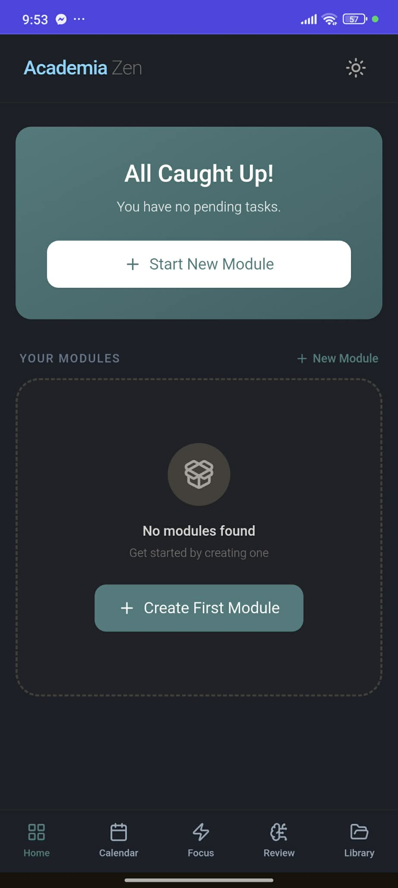
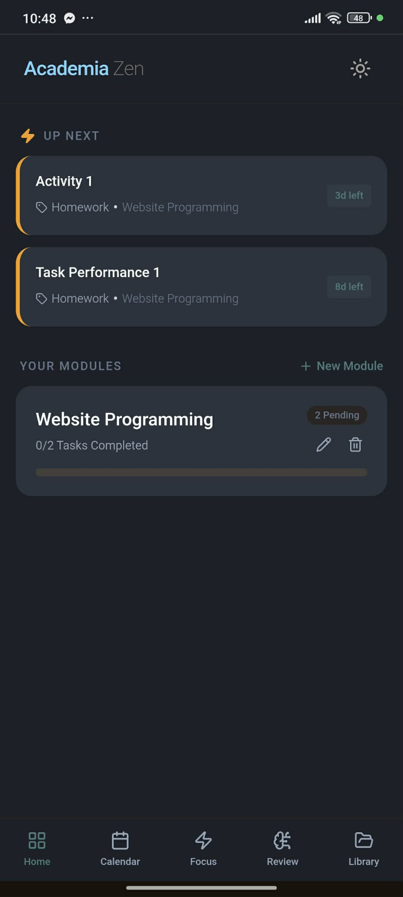
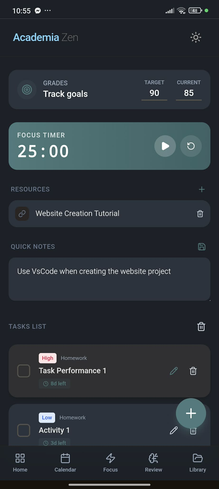
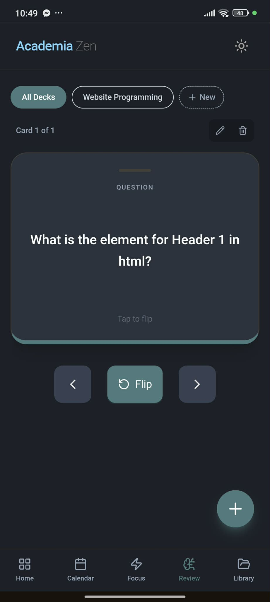
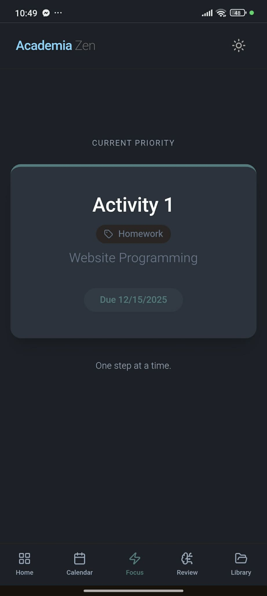
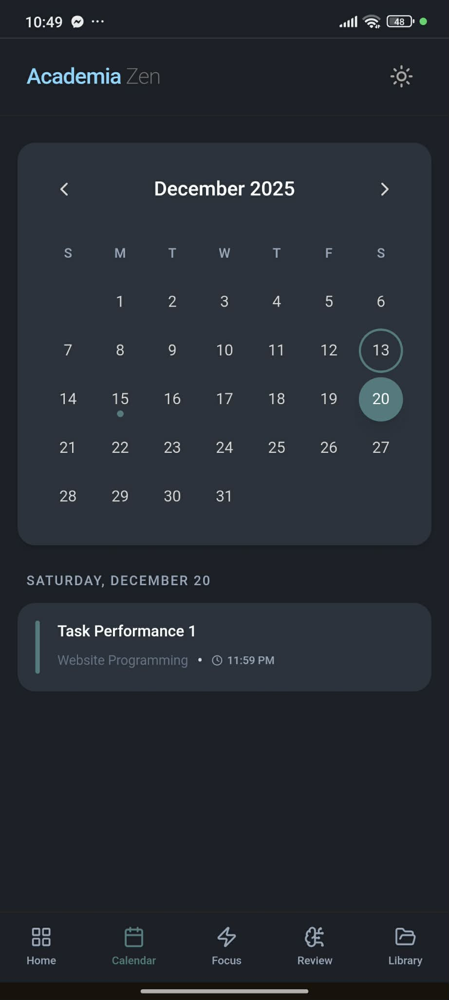
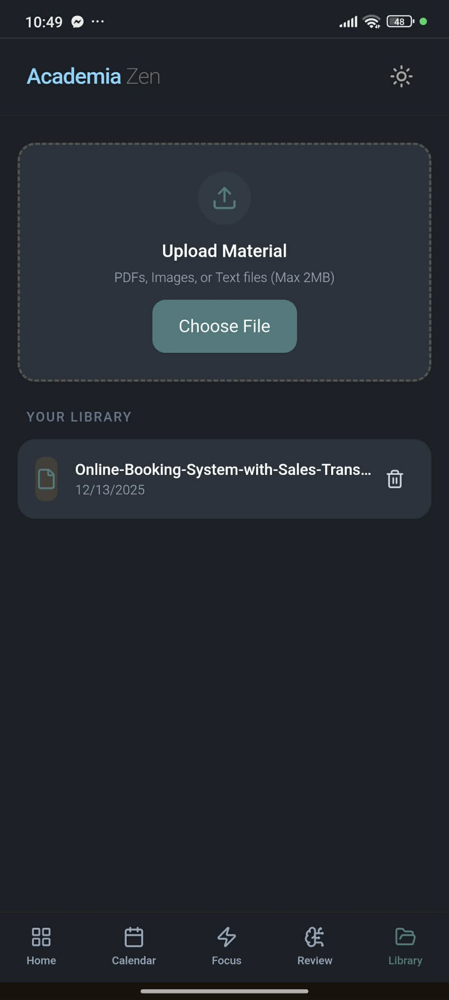

# 🪷 AcademiaZen

**Focus. Learn. Achieve.**

AcademiaZen is a modern, privacy-focused **Progressive Web App (PWA)** built to help students manage tasks, study efficiently, and stay focused — all in one calm, distraction-free workspace.

🔗 **Live App (Installable PWA):**  
👉 https://academia-zen.vercel.app/

You can install AcademiaZen on **Android, iOS, and Desktop** directly from your browser.

---

## 🚀 What is AcademiaZen?

| Feature | Description |
|------|-----------|
| 🎓 Purpose | Academic task & study management |
| 📱 Platform | Web, Android, iOS (PWA) |
| 🔐 Privacy | 100% local storage (no server, no tracking) |
| ⚡ Performance | Fast, lightweight, offline-capable |

---

## ✨ Key Features

| Feature | Explanation |
|------|-----------|
| 📱 Native PWA | Installable on Android, iOS (Safari), and Desktop |
| ✅ Task Management | Organize assignments by subject, priority, and due date |
| 🧠 Flashcards | Spaced repetition with interactive review animations |
| 🍅 Focus Timer | Pomodoro-style deep-focus sessions |
| 📊 Grade Tracking | Track current vs target grades per module |
| 🌓 Dark / Light Mode | Adaptive, eye-friendly UI |
| 🔔 Local Notifications | Task reminders without any backend |

---

## 📸 Screenshots

### 🏠 Core Views

| Starting Dashboard | Dashboard | Subject Detail |
|-------------------|-----------|---------------|
|  |  |  |

### 🧠 Study & Focus

| Flashcard Review | Focus Mode | Calendar |
|------------------|------------|----------|
|  |  |  |

### 📚 Library

| Library View |
|--------------|
|  |

---

## 🛠️ Tech Stack

| Layer | Technology |
|----|-----------|
| Frontend | React.js (Vite) |
| Styling | Tailwind CSS |
| Icons | Lucide React |
| State | Custom React Hooks |
| Storage | LocalStorage |
| PWA | Web App Manifest + Service Workers |
| Hosting | Vercel |

---

## 📲 Install as an App (PWA)

### 🍎 iOS (Safari only)
1. Open 👉 https://academia-zen.vercel.app/
2. Tap **Share**
3. Select **Add to Home Screen**

### 🤖 Android (Chrome)
1. Open 👉 https://academia-zen.vercel.app/
2. Tap **⋮**
3. Select **Install App**

> No App Store. No Play Store. No account required.

---

## 🚀 Getting Started (Local Development)

| Step | Command |
|----|--------|
| Clone | `git clone https://github.com/sean-camara/AcademiaZen.git` |
| Enter | `cd AcademiaZen` |
| Install | `npm install` |
| Dev | `npm run dev` |
| Build | `npm run build` |

---

## 🤝 Contributing

Contributions are welcome.

| Step | Action |
|----|-------|
| 1 | Fork the repository |
| 2 | `git checkout -b feature/AmazingFeature` |
| 3 | `git commit -m "Add AmazingFeature"` |
| 4 | `git push origin feature/AmazingFeature` |
| 5 | Open a Pull Request |

---

## ❤️ Credits

Created with ❤️ by **Sean John Camara**

---

